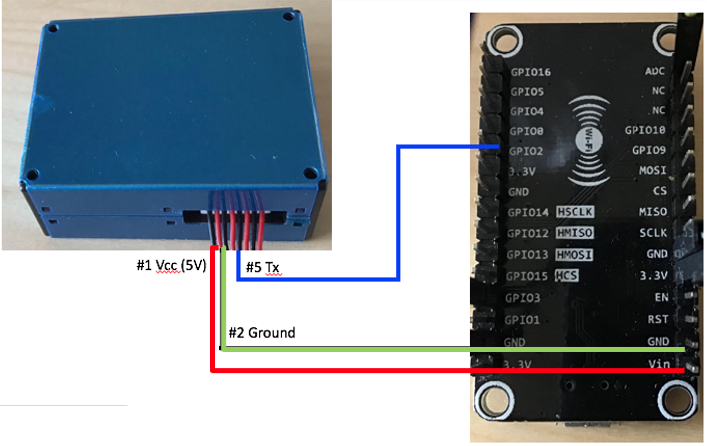
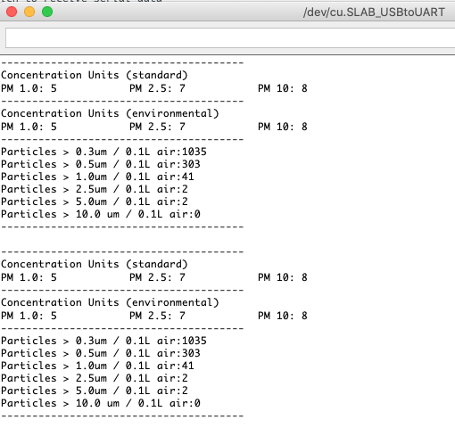

# PM2.5 
File: pm25_basic.ino

In this setup, you will use your NodeMCU to read PM1, PM2.5 and PM10 level from PMS5003. 

You will need:

- NodeMCU v2 cp2102 (~$3)
- PMS5003 (~$14)
- MicroUSB
- Jumper wires

<b>1. Set up NodeMCU:</b> 
Please follow the instructions available at the bottom of this page https://github.com/ICECapstone/Blink to set up your NodeMCU. 

<b>2. Physical connections: </b> 
PMS5003 Vcc -> 5V from nodeMCU Vcc  
PMS5003 Ground -> Ground from NodeMCU ground  
PMS5003 TX -> GPIO2 of NodeMCU  

<b>3. Upload the code to your NodeMCU: </b>  The original code is available at (https://learn.adafruit.com/pm25-air-quality-sensor).

<b>4. Enjoy: </b> 
Once you upload the code, your NodeMCU starts gathering data from PMS5003, and data are displayed on the serial interface.  

---
# PM2.5 with ThingSpeak
File: pm25_TS.ino
